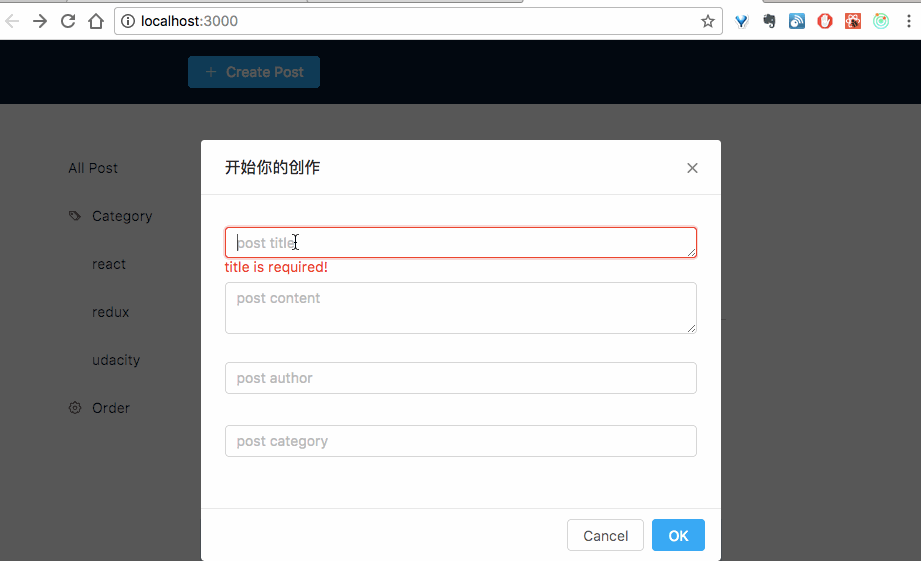
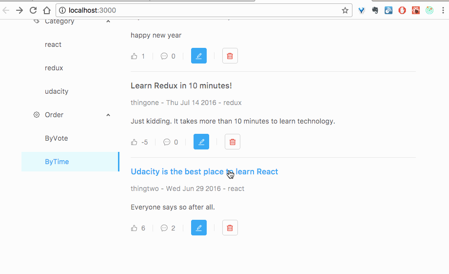

# Readable

## Preview



## Step by Step 

```bash
$ npm install
$ npm start
```

or:

```bash
$ yarn
$ yarn start
```

## API Server
Information about the API server and how to use it can be found in its [README file](https://github.com/udacity/reactnd-project-readable-starter/blob/master/api-server/README.md).